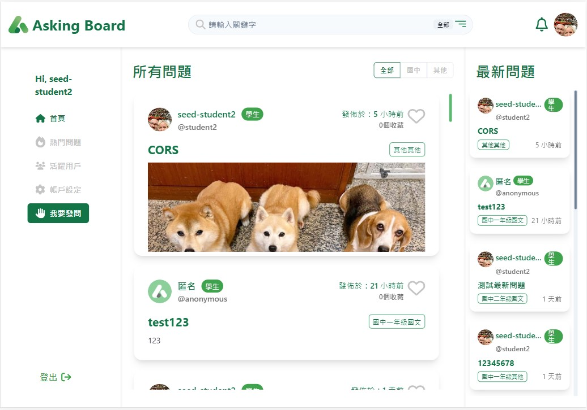

# Asking Board (線上家教問答平台：簡易CRUD實作)

此專案為一線上問答形式互動的小型問答論壇，具社交平台基本功能。團隊開發採前、後分離模式，雙人進行開發。

* This project was bootstrapped with [Create React App](https://github.com/facebook/create-react-app).

## 預設登入帳號

前台使用者：
* Email(帳號)：student2@example.com
* 密碼：password

後台管理者
* Email(帳號)：root@example.com
* 密碼：password

## 專案畫面成果

### 前台首頁畫面


## 專案功能

【前台：一般使用者】
* 可以註冊、登入(一般登入或 google登入)、登出  
* 註冊時可設定暱稱、Email、密碼和身分  
* 登入後能：
  * 使用Searchbar輸入關鍵字做站內搜尋
  * 在首頁瀏覽所有的問題(可依據條件做篩選)
  * 查看熱門問題(回覆數 Top 10)
  * 查看活躍用戶(追蹤者數 Top 10)
  * 新增提問，最多可以上傳一張相關照片
  * 查看特定問題內容及其所有回覆
  * 對問題按愛心圖示收藏 / 取消收藏
  * 對問題的回覆按讚 / 取消按讚
  * 編輯自己提出的問題
  * 點擊大頭貼查看任意使用者：
    * 所有的提問
    * 收藏的提問
    * 回覆過的提問
    * 追蹤者(被關注)清單
    * 追蹤中(關注)清單
  * 追蹤 / 取消追蹤其他使用者
  * 修改自己的暱稱、自我介紹、大頭照
  * 在帳戶設定頁面修改自己的Email(帳號)、身分與密碼(以google登入僅能修改身分) 
  
【後台：管理者】
* 可以登入網站後台
* 可以在後台瀏覽全站問題的部分內容
* 管理者可以在清單上直接刪除任何人的問題
* 管理者可以瀏覽站內所有使用者的清單，清單的資訊包括使用者社群活躍數據：  
  * 提問數量
  * 所有提問被收藏的數量
  * 回答數量
  * 所有回答被按讚的數量
  * 追蹤者和追蹤中數量

## 專案安裝流程
0. 打開終端機
1. 以指令下載此專案 
  ```
  git clone https://github.com/Peggy8422/asking-board.git
  ```
2. 進入專案資料夾
  ```
  cd asking-board
  ```
3. 安裝必備套件 **此步驟會等待較長時間
  ```
  npm install 
  ```
4. 啟動專案 
  ```
  npm start
  ```
5. 於 localhost:3000 開始使用
6. 如欲退出可按ctrl + c

## 開發者
後端 <br>
[Howard Wu](https://github.com/HowardWu5566) <br>
<br>
前端 <br>
[Peggy](https://github.com/Peggy8422) <br>


